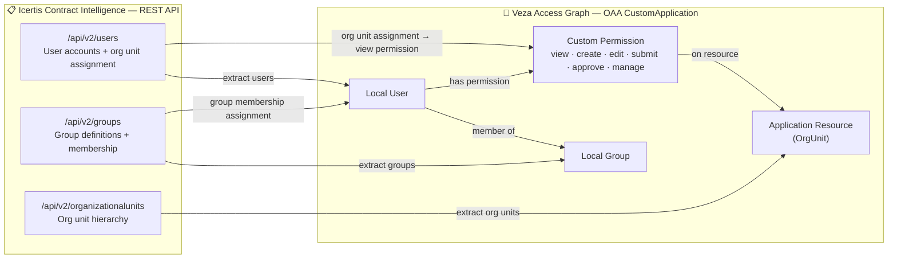

# Icertis → Veza OAA Integration

Pushes **Icertis Contract Intelligence** identity and permission data — users, groups, and org units — into the [Veza](https://www.veza.com) Access Graph using the [Open Authorization API (OAA)](https://docs.veza.com/developers/api/oaa/getting-started).

---

## 1. Overview

This integration connects to Icertis via its REST API (OAuth 2.0 — Client Credentials), collects identity and organizational data, and builds a `CustomApplication` OAA payload that Veza ingests to answer questions like:

- Which users have access to Icertis and what roles do they hold?
- What groups does a given user belong to?
- Which org unit does each user belong to?
- Who has administrative or approval rights?

### Entity Model

| Icertis Source | Veza OAA Entity | Notes |
|---|---|---|
| Users (`/api/v2/users`) | Local User | Email used as identity; links to IdP |
| Groups (`/api/v2/groups`) | Local Group | Users assigned via membership API |
| Org Units (`/api/v2/organizationalunits`) | Application Resource (type: `OrgUnit`) | Users granted `view` on their assigned org unit |

### OAA Permission Mapping

| Permission Name | Veza Canonical Permissions |
|---|---|
| `view`    | DataRead |
| `create`  | DataRead, DataWrite |
| `edit`    | DataRead, DataWrite |
| `submit`  | DataRead, DataWrite |
| `approve` | DataRead, DataWrite, MetadataRead |
| `manage`  | DataRead, DataWrite, MetadataRead, MetadataWrite, NonData |

---

## 2. Entity Relationship Map



---

## 3. How It Works

1. **Authenticate** — POST to the OAuth2 token endpoint with `client_credentials` grant; receive a Bearer token.
2. **Fetch users** — paginated `GET /api/v2/users` (100 per page).
3. **Fetch groups** — paginated `GET /api/v2/groups` (100 per page).
4. **Fetch org units** — single `GET /api/v2/organizationalunits`.
5. **Build membership map** — for each group, retrieve members via `GET /api/v2/groups/{id}/members` (used when memberships are not embedded in the user response).
6. **Assemble OAA payload** — creates a `CustomApplication` object with local users (linked to IdP via email), local groups, and org unit resources; assigns group memberships and org unit view permissions.
7. **Push to Veza** — `OAAClient.push_application()` with `create_provider=True`.

---

## 4. Prerequisites

| Requirement | Details |
|---|---|
| **Python** | 3.9 or higher |
| **OS** | RHEL 8+/CentOS 8+/Amazon Linux 2023 or Ubuntu 20.04+ |
| **Icertis API access** | Service principal with read access to users, groups, org units |
| **Azure AD app** | Client credentials grant; `api://6c49748d-db77-4577-b9d0-e31330bc889c/.default` scope (or your tenant's scope) |
| **Veza** | Tenant URL + API key with `Push` permissions for OAA providers |
| **Network** | Outbound HTTPS (443) to `*.icertis.com` and your Veza tenant |

---

## 5. Quick Start

```bash
curl -fsSL https://raw.githubusercontent.com/YOUR_ORG/YOUR_REPO/main/integrations/icertis/install_icertis.sh | bash
```

The installer will prompt for your Icertis and Veza credentials and set up everything under `/opt/VEZA/icertis-veza/`.

---

## 6. Manual Installation

### RHEL / CentOS / Amazon Linux

```bash
sudo dnf install -y python3 python3-pip git curl
git clone https://github.com/YOUR_ORG/YOUR_REPO.git
cd YOUR_REPO/integrations/icertis

python3 -m venv venv
source venv/bin/activate
pip install -r requirements.txt

cp .env.example .env
chmod 600 .env
# Edit .env with your credentials
nano .env
```

### Ubuntu / Debian

```bash
sudo apt-get update && sudo apt-get install -y python3 python3-pip python3-venv git curl
git clone https://github.com/YOUR_ORG/YOUR_REPO.git
cd YOUR_REPO/integrations/icertis

python3 -m venv venv
source venv/bin/activate
pip install -r requirements.txt

cp .env.example .env
chmod 600 .env
nano .env
```

### `.env` Configuration

```bash
# Icertis Source
ICERTIS_BASE_URL=https://yourcompany.icertis.com
ICERTIS_TOKEN_URL=https://login.microsoftonline.com/<tenant-id>/oauth2/v2.0/token
ICERTIS_CLIENT_ID=<azure-app-client-id>
ICERTIS_CLIENT_SECRET=<azure-app-client-secret>
ICERTIS_SCOPE=api://6c49748d-db77-4577-b9d0-e31330bc889c/.default

# Veza
VEZA_URL=https://yourcompany.veza.com
VEZA_API_KEY=<veza-api-key>
```

---

## 7. Usage

```
python3 icertis.py [OPTIONS]
```

| Argument | Required | Values | Default | Description |
|---|---|---|---|---|
| `--env-file` | No | path | `.env` | Path to .env file |
| `--dry-run` | No | flag | off | Build payload without pushing to Veza |
| `--save-json` | No | flag | off | Save OAA payload JSON to disk |
| `--log-level` | No | DEBUG INFO WARNING ERROR | INFO | Logging verbosity |
| `--veza-url` | † | URL | `$VEZA_URL` | Veza tenant URL |
| `--veza-api-key` | † | string | `$VEZA_API_KEY` | Veza API key |
| `--provider-name` | No | string | `Icertis` | Provider name in Veza UI |
| `--datasource-name` | No | string | `Icertis` | Datasource name in Veza UI |
| `--base-url` | Yes | URL | `$ICERTIS_BASE_URL` | Icertis instance base URL |
| `--token-url` | Yes | URL | `$ICERTIS_TOKEN_URL` | OAuth2 token endpoint |
| `--client-id` | Yes | string | `$ICERTIS_CLIENT_ID` | OAuth2 client ID |
| `--client-secret` | Yes | string | `$ICERTIS_CLIENT_SECRET` | OAuth2 client secret |
| `--scope` | No | string | `api://6c49748d-.../.default` | OAuth2 scope |

† Required unless `--dry-run` is set.

### Examples

```bash
# Dry-run — validate payload locally, save JSON
python3 icertis.py --dry-run --save-json --log-level DEBUG

# Live push with explicit credentials
python3 icertis.py --veza-url https://company.veza.com --veza-api-key <key>

# Run preflight checks
bash preflight_icertis.sh --all
```

---

## 8. Deployment on Linux

### Service account

```bash
sudo useradd -r -s /bin/bash -m -d /opt/VEZA/icertis-veza icertis-veza
sudo chown -R icertis-veza: /opt/VEZA/icertis-veza
sudo chmod 700 /opt/VEZA/icertis-veza/scripts
sudo chmod 600 /opt/VEZA/icertis-veza/scripts/.env
```

### SELinux (RHEL)

```bash
getenforce
# If Enforcing:
sudo restorecon -Rv /opt/VEZA/icertis-veza
```

### Cron schedule (daily at 02:00)

Create a wrapper script `/opt/VEZA/icertis-veza/scripts/run_icertis.sh`:

```bash
#!/usr/bin/env bash
set -euo pipefail
cd /opt/VEZA/icertis-veza/scripts
source venv/bin/activate
python3 icertis.py --env-file .env
```

```bash
chmod +x /opt/VEZA/icertis-veza/scripts/run_icertis.sh
```

`/etc/cron.d/icertis-veza`:
```
0 2 * * * icertis-veza /opt/VEZA/icertis-veza/scripts/run_icertis.sh >> /opt/VEZA/icertis-veza/logs/cron.log 2>&1
```

### Log rotation

`/etc/logrotate.d/icertis-veza`:
```
/opt/VEZA/icertis-veza/logs/*.log {
    daily
    rotate 14
    compress
    missingok
    notifempty
    su icertis-veza icertis-veza
}
```

---

## 9. Security Considerations

- `.env` must be `chmod 600` and owned by the service account only.
- Rotate the Azure AD client secret and Veza API key on your organization's regular rotation schedule.
- The Azure AD service principal should have the **minimum required Icertis API permissions** — read-only access to users, groups, and org units.
- On SELinux systems, run `restorecon` after deploying files.
- On AppArmor systems, ensure `/opt/VEZA/icertis-veza/` is in the allowed path set.

---

## 10. Troubleshooting

| Symptom | Cause | Resolution |
|---|---|---|
| `Missing required configuration: ICERTIS_CLIENT_SECRET` | `.env` not loaded | Check `--env-file` path; ensure `.env` exists and is readable |
| OAuth2 token request fails (HTTP 400/401) | Wrong client ID, secret, or scope | Verify Azure AD app credentials; check scope value matches your tenant |
| `Cannot reach <host>:443` | Firewall/proxy blocking outbound HTTPS | Allow outbound 443 to `*.icertis.com` and your Veza tenant hostname |
| `Veza push failed: ... HTTP 403` | API key lacks push permissions | Re-generate API key with OAA Push permissions in Veza Admin |
| `users: 0` in payload | API endpoint or pagination mismatch | Run with `--log-level DEBUG` and inspect log; adjust `_get` path if Icertis API differs |
| `Could not add user X to group Y` | Group not in group list (e.g. embedded group name mismatch) | Run `--save-json --log-level DEBUG` to inspect payload; verify group names |
| Python `ModuleNotFoundError` | venv not activated or deps not installed | `source venv/bin/activate && pip install -r requirements.txt` |

---

## 11. Changelog

| Version | Date | Notes |
|---|---|---|
| v1.0 | 2026-05-05 | Initial release — users, groups, org units via OAuth2 Client Credentials |
